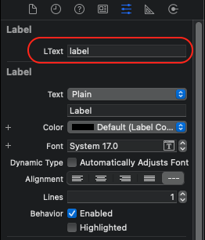
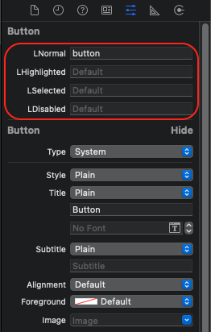
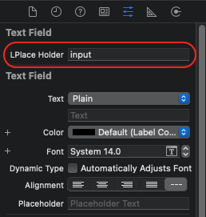
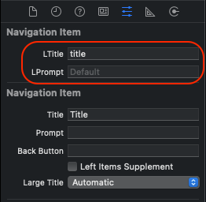
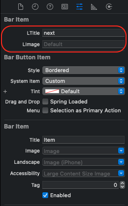

# CLLocalization


## What's this?

`CLLocalization` is a Localization library written in Swift.

## Requirements

* iOS 9.0+

## Installation

#### CocoaPods

```
pod 'CLLocalization'
```

## Contribution

You are welcome to fork and submit pull requests.

## License

`CLLocalization` is open-sourced software, licensed under the `MIT` license.

## Usage

#### Required files: 

Add files to your project:

- English: 'localization_en.json'

- Vietnamese: 'localization_vi.json'

- And more ....

Content of file:

```json
{
    "button": "My button",
    "label": "My label",
    "cancel": "Cancel",
    "next": "Next",
    "input": "Tap here to input",
}
```

#### Initialize:

```
func application(_ application: UIApplication, didFinishLaunchingWithOptions launchOptions: [UIApplication.LaunchOptionsKey: Any]?) -> Bool {
    // Override point for customization after application launch.
    CLLocalization.initialize(["en", "vi"])
    return true
}

```
Note: Device language will be used
  
#### Change language:

- Change to target language:

```
CLLocalization.setLanguage("en")
     
```
  
- Change back to use device language:

```
CLLocalization.setLanguage(nil)

```
  
#### Storyboard:

- UILabel:



- UIButton:



- UITextField:



- UINavigationItem:



- UIBarItem:



#### Code:

```json
import CLLocalization
```

- UILabel:

```json
label.lText = "label"
```

- UIButton:

```json
button.lNormal = "button_normal"
button.lHighlighted = "button_hightlighted"
button.lSelected = "button_selected"
button.lDisabled = "button_disabled"
```

- UITextField:

```json
textField.lPlaceHolder = "text_field_place_holder"
```

- UINavigationItem:

```json
navigationItem.lTitle = "navigation_title"
navigationItem.lPrompt = "navigation_prompt"
```

- UIBarItem:

```json
barItem.lTitle = "bar_item_title"
```

- String

```json
String localizedString = "text".localized
```

## Example

Please find in project
